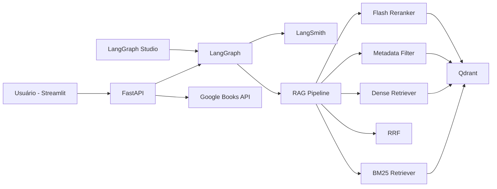

# 📚 Sistema de Recomendação de Livros Com Agentes de IA

Sistema de **Recomendação de Livros** baseado em **Agentes de IA + RAG (Retrieval-Augmented Generation)**, utilizando **Google Books API**, **LangGraph**, **LangChain**, **Qdrant**, **FastAPI**, **Streamlit** e **LangSmith**.

---

## 📌 Visão Geral

Esta Proof of Concept (POC) demonstra como construir um sistema **agentic, observável e explicável** de recomendação de livros, capaz de:

- Interpretar a intenção do usuário em linguagem natural;
- Consultar a **Google Books API** como fonte primária de dados;
- Armazenar dados e embeddings em uma **base vetorial Qdrant**;
- Executar uma **pipeline RAG avançada** com múltiplas etapas de recuperação e reranqueamento;
- Gerar recomendações personalizadas com **explicações claras**;
- Fornecer **observabilidade completa** via LangSmith;
- Permitir desenvolvimento e depuração visual usando **LangGraph Studio**.

---

## 🎯 Objetivos da POC

- Validar uma arquitetura **multiagente com LangGraph**;
- Demonstrar uma pipeline RAG híbrida (lexical + semântica);
- Servir como **base reutilizável** para outros sistemas de recomendação;
- Facilitar evolução para ambientes produtivos;
- Garantir **transparência, rastreabilidade e controle de custo de LLMs**.

---

## 🧠 Stack Tecnológica

| Camada | Tecnologia |
|------|-----------|
| Orquestração de Agentes | LangGraph |
| LLM + RAG | LangChain |
| Observabilidade | LangSmith |
| IDE de Agentes | LangGraph Studio |
| Base Vetorial | Qdrant |
| Backend | FastAPI |
| Frontend | Streamlit |
| Fonte de Dados | Google Books API |

---

## 🏗️ Arquitetura Geral



---

## 🔍 Funcionalidades Principais

- 🔎 Busca de livros por título, autor, tema ou palavras-chave;
- 🧠 Aprendizado contínuo baseado no histórico do usuário;
- 🗂️ Armazenamento vetorial com metadados estruturados;
- 🤖 Arquitetura multiagente orientada a intenção;
- 📊 Reranqueamento híbrido (lexical + semântico);
- 🧾 Geração de explicações para cada recomendação;
- 📈 Monitoramento completo de métricas e fluxos;
- 🧪 Testes visuais e depuração com LangGraph Studio.

---

## 🧬 Pipeline RAG

```
BM25 Retriever
   ↓
Dense Retriever
   ↓
Metadata Filter
   ↓
RRF (Reciprocal Rank Fusion)
   ↓
Flash Reranker
```

---

## 🤖 Arquitetura de Agentes (LangGraph)

- **User Intent Analyzer Agent**
- **Retriever Agent**
- **Recommendation Agent**
- **Explanation Agent**

---

## 📊 Observabilidade com LangSmith

Monitoramento de latência, custo, qualidade e rastreabilidade completa.

---

## 🚀 Como Executar

**Configure variáveis de ambiente**

```bash
.env
```

**Executar Streamlit (sem precisar do FastAPI)**

```bash
streamlit run frontend/app.py
```

**Executar LangGraph Studio**

```bash
langgraph dev
```

**Executar LangGraph Studio**

```bash
langgraph dev
```

---
